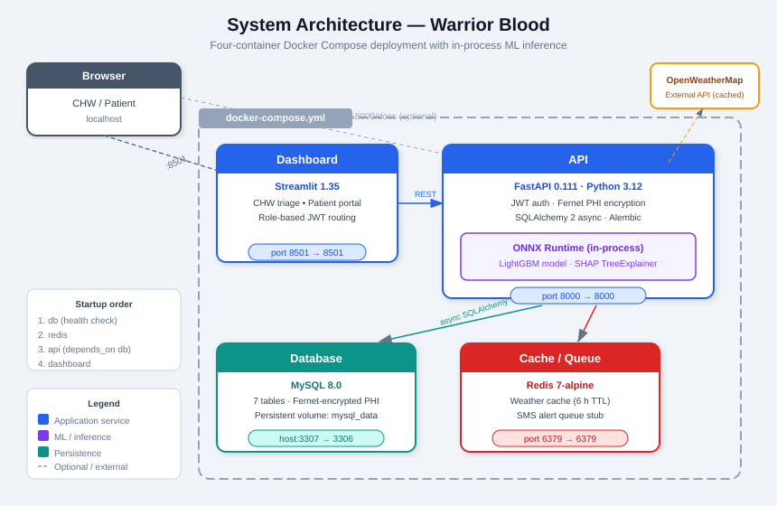
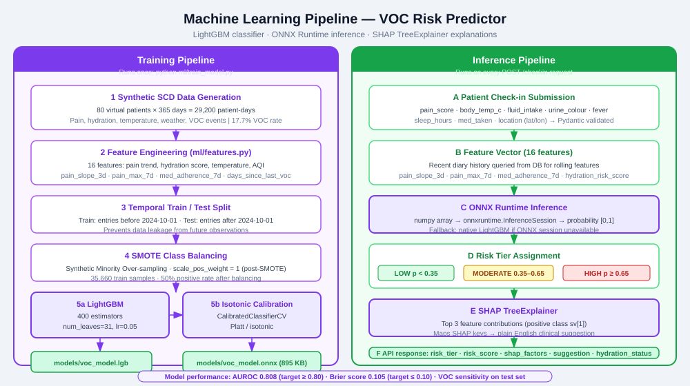
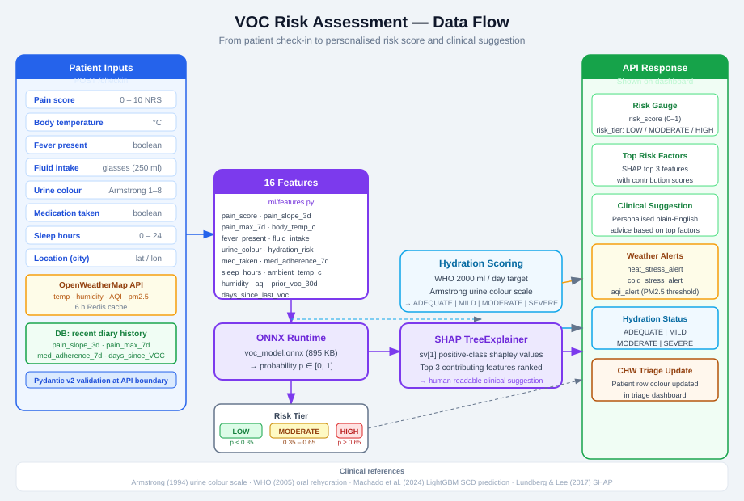
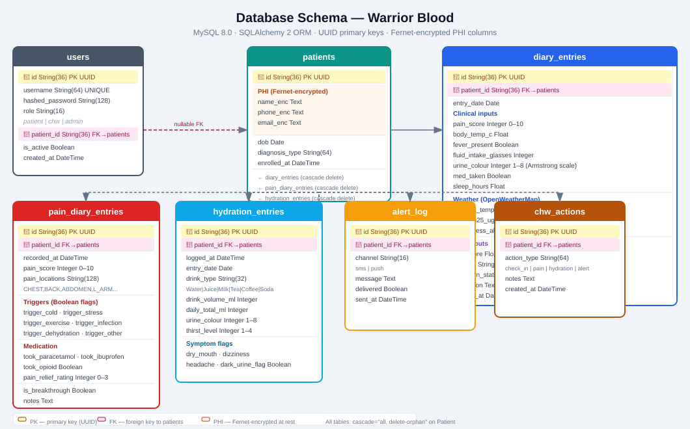
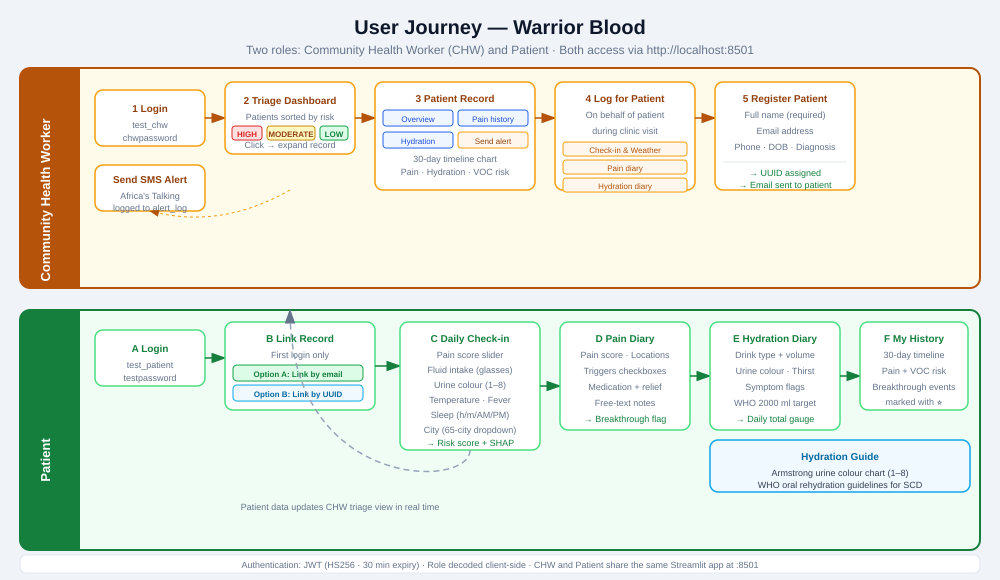

# Warrior Blood — Project Diagrams

Five technical diagrams covering the full system. Each SVG is self-contained and can be opened directly in a browser or embedded in any document.

---

## 1. System Architecture

**File:** [architecture.svg](architecture.svg)

The runtime environment is a single `docker-compose.yml` file that starts four containers in dependency order. The **Dashboard** (Streamlit) and **API** (FastAPI) are built from the same `Dockerfile` and serve separate ports. The **API** contains the ONNX Runtime as an in-process library — no separate ML service is needed. **MySQL** stores all clinical data with Fernet-encrypted PHI columns. **Redis** provides a 6-hour cache for OpenWeatherMap responses and acts as a stub queue for SMS alerts.

The browser connects directly to Streamlit on port 8501. Streamlit issues REST calls to the API on port 8000. The Swagger UI (`/docs`) is available for direct API testing.

---

## 2. Machine Learning Pipeline

**File:** [ml_pipeline.svg](ml_pipeline.svg)

The pipeline runs in two distinct phases.

**Training** (`python ml/train_model.py`) generates 29,200 synthetic SCD patient-days (80 patients × 365 days) at a realistic 17.7% VOC rate. Entries are split temporally — train before 2024-10-01, test after — to prevent data leakage from future observations. SMOTE balances the training set to 50% positive rate. A LightGBM classifier (400 estimators, `num_leaves=31`) is trained with `scale_pos_weight=1` (post-SMOTE), then wrapped in isotonic calibration. The calibrated model is exported both as a native `.lgb` file and as a 895 KB ONNX file.

**Inference** runs on every `POST /checkin` request. The 16-feature vector is assembled from the submitted form data and recent diary history queried from the database. The ONNX Runtime session produces a calibrated probability. A SHAP TreeExplainer computes shapley values for the positive class (`sv[1]`), and the top three contributing features are mapped to plain-English clinical suggestions.

**Model performance:** AUROC 0.808 (target ≥ 0.80) · Brier score 0.105 (target ≤ 0.10)

---

## 3. VOC Risk Assessment Flow

**File:** [risk_assessment.svg](risk_assessment.svg)

This diagram traces a single check-in submission from input to output. Patient-entered data is validated by Pydantic at the API boundary. Weather data is fetched from OpenWeatherMap (or served from the 6-hour Redis cache). Recent diary history is queried from the database to compute rolling features such as `pain_slope_3d` and `med_adherence_7d`.

The 16-feature vector enters ONNX Runtime and returns a probability. The probability maps to a risk tier: **LOW** (< 0.35), **MODERATE** (0.35–0.65), **HIGH** (≥ 0.65). Separately, SHAP identifies the top three drivers of that score. A parallel hydration pathway computes status against the WHO 2,000 ml/day target using the Armstrong urine colour scale. All outputs — risk gauge, top factors, clinical suggestion, weather alerts, hydration status — are returned in a single API response and rendered immediately on the dashboard.

---

## 4. Database Schema

**File:** [database_schema.svg](database_schema.svg)

Seven tables, all using UUID string primary keys. The **patients** table is the central entity; every other table holds a foreign key to `patients.id` with cascade delete. The three PHI columns in **patients** (`name_enc`, `phone_enc`, `email_enc`) store Fernet ciphertext — they are never written or read in plaintext outside the application layer.

**diary_entries** is the widest table, combining clinical inputs, weather fields populated by the API, and ML outputs (risk score, risk tier, SHAP JSON). This avoids joins at query time when rendering the triage timeline.

**pain_diary_entries** captures granular pain episodes including location codes, trigger booleans, medication taken, and whether the episode qualifies as a breakthrough event (pain ≥ 7 or opioid taken). **hydration_entries** logs each individual drink and accumulates a daily total.

**users** links to **patients** through a nullable `patient_id` FK — CHW accounts have no associated patient record.

---

## 5. User Journey

**File:** [user_journey.svg](user_journey.svg)

Two swimlanes represent the two roles. Both users log in at the same Streamlit URL; the JWT `role` claim routes them to the appropriate dashboard.

**CHW** starts at the triage view — all registered patients sorted by current risk tier (HIGH first). Expanding a patient row reveals four tabs: a 30-day dual-axis timeline, pain history with breakthrough markers, a 7-day hydration bar chart against the WHO target, and a manual SMS alert panel. The CHW can also log check-ins, pain entries, or hydration entries on behalf of patients who attended a clinic visit. New patients are registered with a name, email, optional phone and DOB, and a diagnosis type; the system assigns a UUID and records the encrypted email for future patient-side lookup.

**Patient** must link their clinical record on first login — either by entering the email their CHW registered, or by entering their UUID directly. Once linked, they can submit daily check-ins (the primary data source for the ML model), log detailed pain diary entries, and track their hydration throughout the day. The **My History** page shows a combined 30-day timeline. Any data the patient logs is immediately reflected in the CHW triage view.

---

## File list

| Diagram | File | Dimensions |
|---------|------|------------|
| System Architecture | [architecture.svg](architecture.svg) | 860 × 560 |
| ML Pipeline | [ml_pipeline.svg](ml_pipeline.svg) | 1000 × 560 |
| VOC Risk Assessment Flow | [risk_assessment.svg](risk_assessment.svg) | 920 × 620 |
| Database Schema (ERD) | [database_schema.svg](database_schema.svg) | 1060 × 660 |
| User Journey | [user_journey.svg](user_journey.svg) | 1000 × 580 |
